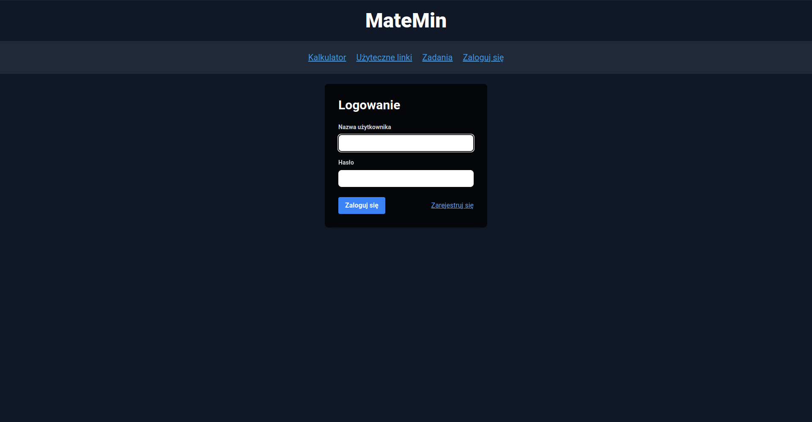
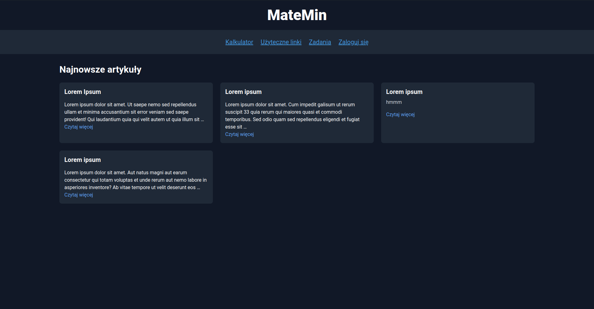
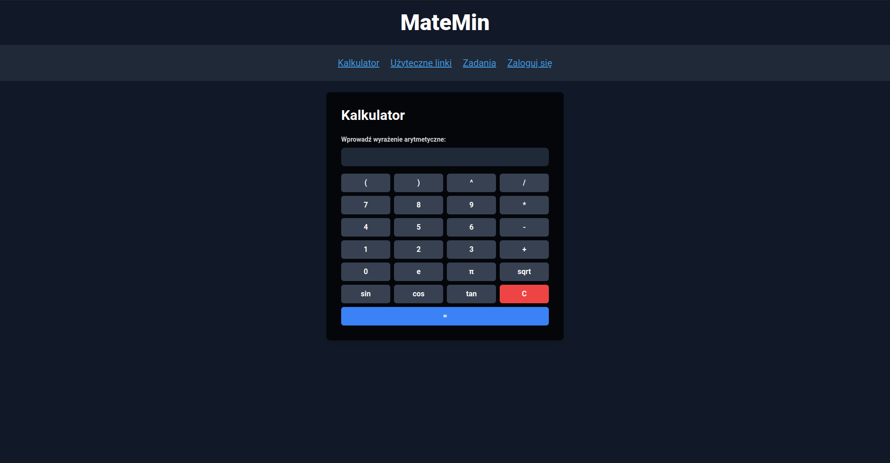
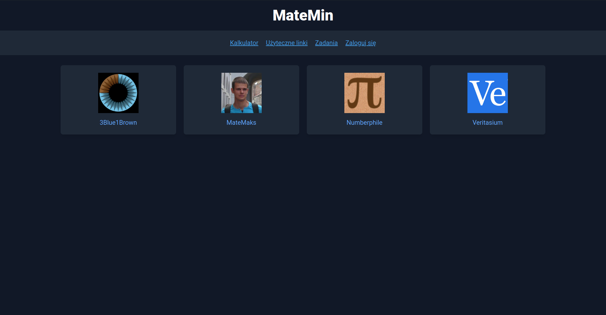
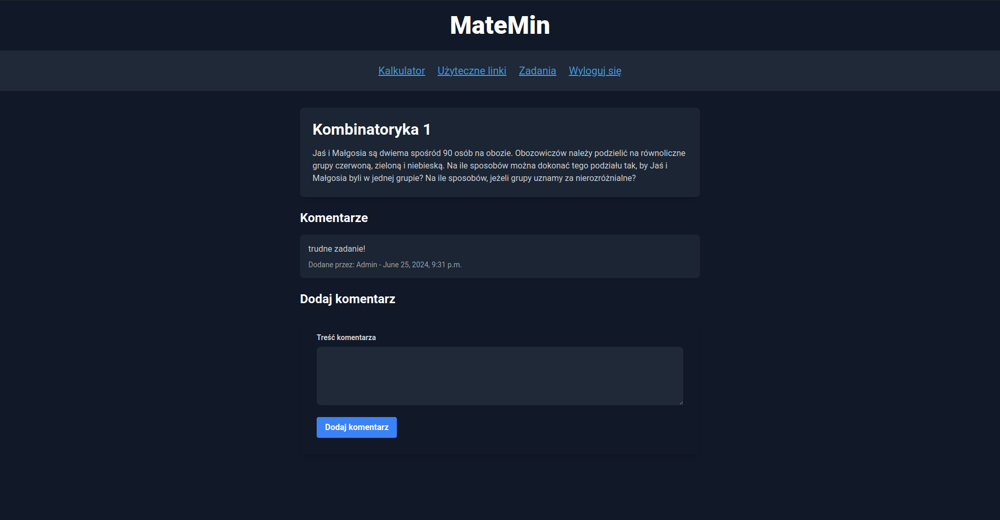

---

# MateMin

Strona internetowa do zarządzania artykułami i zadaniami z zakresu matematyki.

## Funkcje

1. **Rejestracja i logowanie użytkowników**
   - Użytkownicy mogą się rejestrować i logować na swoje konta.

2. **Artykuły i zadania**
   - Użytkownicy mogą przeglądać listę artykułów i zadań.

3. **Dodawanie komentarzy**
   - Zalogowani użytkownicy mogą dodawać komentarze pod artykułami i zadaniami.

4. **Linki edukacyjne**
   - Przeglądanie i dostęp do linków edukacyjnych na różne tematy.

5. **Zarządzanie treściami**
   - Użytkownicy z uprawnieniami administratora mogą dodawać nowe zadania i artykuły.
  
6. **Kalkulator**
   - Wbudowany kalkulator liczący między innymi funkcje trygonometryczne.

## Instalacja

1. Pobierz repozytorium na komputer:

2. Zainstaluj zależności:
   Upewnij się, że masz zainstalowane django, jeżeli nie, to możesz to zrobić przez pip:

   ```
   pip install django
   ```

3. Uruchom serwer:
   ```
   python manage.py runserver
   ```

4. Przejdź do `http://localhost:8000` w przeglądarce, aby zobaczyć działającą stronę.

## Użycie
### 1. Logowanie i rejestracja

Możesz zarejestrować nowe konto lub zalogować się przy użyciu istniejącego.



Zalogowany użytkownik uzyskuje dostęp do zadań oraz komentowania artykułów.

Testowy użytkownik jest utworzony domyślnie.

- Nazwa Użytkownika: Janek

- Hasło: 123456aza

Testowy administrator jest utworzony domyślnie.

- Nazwa użytkownika: Admin

- Hasło: admin

Aby utworzyć własne konto administratora należy wykonać komende:
   ```
   python manage.py createsuperuser
   ```
lub nadać nowemu kontu uprawnienia z panelu administratora.

Aby zalogować się do panelu administratora, należy udać się do `http://localhost:8000/admin`.
W tym panelu można edytować artykuły i zadania oraz zarządzać użytkownikami, w tym ich uprawnieniami.

### 2. Czytanie artykułów



### 3. Kalkulator

Kalkulator napisany został przy użyciu JavaScript.



### 4. Edukacyjne linki

Klikając na link, zostaniesz przekierowany bezpośrednio do źródła.



### 5. Zadania
Po zalogowaniu się użytkownik uzyskuje dostęp do zadań.




## Wykorzystane Technologie

- Python 3
- Django 3
- HTML, CSS
- JavaScript

---
